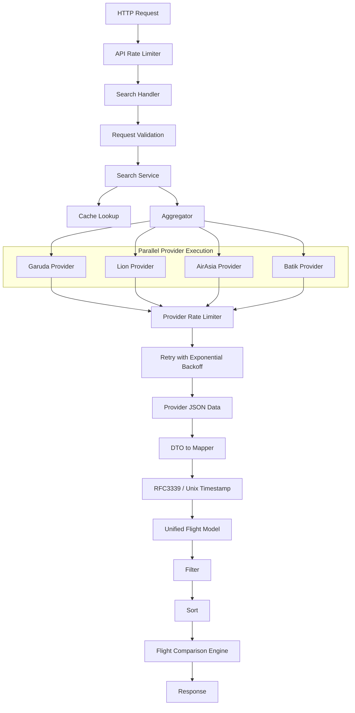

# Book Cabin

A Go-based flight search aggregator that collects flight data concurrently from multiple airline providers, normalizes the responses into a unified model, and returns the best available results with filtering, sorting and caching.

## Features

* Concurrent search across multiple airline providers
* Provider pattern for easy extensibility
* DTO → Domain Model mapping
* Generic JSON loader
* Aggregation layer
* In-memory cache
* Filtering
* Sorting
* Timezone Handling
* Best Value ranking algorithm
* Request validation
* Partial failure handling
* Context propagation
* Provider timeout
* API rate limiting
* Provider rate limiting
* Retry with exponential backoff
* Flight Comparison Engine

---

# Supported Providers

* Garuda Indonesia
* Lion Air
* AirAsia
* Batik Air

Each provider has:

* DTO
* Mapper
* Provider implementation
* Mock JSON response

---

# Project Structure

```
book-cabin/
│
├── api/
│   └── main.go
│
├── aggregation/
├── cache/
├── comparison/
├── constant/
├── dto/
├── external/
├── handler/
├── helper/
├── loader/
├── mapper/
├── model/
├── provider/
├── response/
├── router/
    └── middleware/
├── service/
├── util/
├── validator/
│
├── go.mod
└── README.md
```

---

# System Architecture


Flight schedules are normalized into RFC3339 timestamps
with timezone offsets preserved. Unix timestamps are used
for accurate comparison and sorting across different
Indonesian timezones (WIB, WITA, WIT).

---

# Setup

## Prerequisites

* Go 1.26+
* Git

Clone the repository

```bash
git clone https://github.com/fandrien/book-cabin.git

cd book-cabin
```

Install dependencies

```bash
go mod tidy
```

Run the application

```bash
go run ./api
```

Server will start on

```
http://localhost:8080
```

---

# API

## Search Flights

```
POST /search
```

### Request

```json
{
  "origin": "CGK",
  "destination": "DPS",
  "departureDate": "2025-12-15",
  "returnDate": "",
  "arrivalDate": "2025-12-15",
  "airlines": ["AirAsia", "Lion Air"],
  "stops": 1,
  "minDuration": 60,
  "maxDuration": 500,
  "minPrice": 100000,
  "maxPrice": 1000000,
  "sort_by": "best",
  "sort_order": "asc"
}
```

### Response
```json
{
    "total_flights": 2,
    "search_time_ms": 263,
    "provider_logs": [
        {
            "name": "AirAsia",
            "success": true,
            "flight_count": 4,
            "duration_ms": 112
        },
        {
            "name": "Garuda Indonesia",
            "success": true,
            "flight_count": 3,
            "duration_ms": 146
        },
        {
            "name": "Lion Air",
            "success": true,
            "flight_count": 3,
            "duration_ms": 208
        },
        {
            "name": "Batik Air",
            "success": true,
            "flight_count": 3,
            "duration_ms": 262
        }
    ],
    "flights": [
        {
            "id": "JT650_Lion_Air",
            "provider": "Lion Air",
            "airline": {
                "name": "Lion Air",
                "code": "JT"
            },
            "flight_number": "JT650",
            "departure": {
                "airport": "CGK",
                "city": "Jakarta",
                "datetime": "2025-12-15T16:20:00+07:00",
                "timestamp": 1765790400
            },
            "arrival": {
                "airport": "DPS",
                "city": "Denpasar",
                "datetime": "2025-12-15T21:10:00+08:00",
                "timestamp": 1765804200
            },
            "duration": {
                "total_minutes": 305,
                "formatted": "3h 50m"
            },
            "stops": 1,
            "price": {
                "amount": 780000,
                "currency": "IDR"
            },
            "available_seats": 52,
            "cabin_class": "ECONOMY",
            "aircraft": "Boeing 737-800",
            "amenities": [],
            "baggage": {
                "carry_on": "7 kg",
                "checked": "20 kg"
            }
        },
        {
            "id": "QZ7250_AirAsia",
            "provider": "AirAsia",
            "airline": {
                "name": "AirAsia",
                "code": "QZ"
            },
            "flight_number": "QZ7250",
            "departure": {
                "airport": "CGK",
                "city": "",
                "datetime": "2025-12-15T15:15:00+07:00",
                "timestamp": 1765786500
            },
            "arrival": {
                "airport": "DPS",
                "city": "",
                "datetime": "2025-12-15T20:35:00+08:00",
                "timestamp": 1765802100
            },
            "duration": {
                "total_minutes": 354,
                "formatted": "5h 54m"
            },
            "stops": 1,
            "price": {
                "amount": 485000,
                "currency": "IDR"
            },
            "available_seats": 88,
            "cabin_class": "economy",
            "aircraft": null,
            "amenities": null,
            "baggage": {
                "carry_on": "Cabin Baggage Only",
                "checked": "Additional fee"
            }
        }
    ]
}
```

---

# Available Filters

| Filter           | Description         |
| ---------------- | ------------------- |
| origin           | Origin airport      |
| destination      | Destination airport |
| departureDate    | Departure date      |
| arrivalDate      | Arrival date        |
| returnDate       | Return date         |
| airlines         | Filter by airlines  |
| minPrice         | Min Price           |
| maxPrice         | Max Price           |
| minDuration      | Min Flight Duration |
| maxDuration      | Max Flight Duration |
| stops            | Number of stops     |


---

# Sorting

Supported sorting fields

* best (default)
* price
* duration
* departure
* arrival

Supported order

* asc
* desc

---

# Timezone Handling

All provider schedules are normalized into RFC3339 format.

The system preserves timezone offsets and stores Unix timestamps
for accurate duration calculations, sorting, and comparison across
different regions (WIB, WITA, WIT).

Example:

2025-12-15T08:00:00+07:00  (WIB)
2025-12-15T11:00:00+08:00  (WITA)

Timezone-aware calculations ensure correct flight ordering and
travel duration regardless of local airport timezone.

---

## Best Value Algorithm

If no sorting option is specified, flights are ranked using a custom Best Value algorithm.

The score combines:

- Ticket price (lower is better)
- Total travel duration (shorter is better)
- Number of stops (fewer stops are strongly preferred)

Flights with fewer stops receive a significant advantage, making direct flights rank higher whenever possible.

The flight with the lowest score is considered the best value.

---

# Caching

Search results are cached in memory.

Cache key is generated from the search request parameters.

Benefits:

* Faster repeated searches
* Reduced provider calls
* Lower response time

---

# Timeout

Each provider request is executed with its own timeout using Go Context.

If a provider exceeds the configured timeout:

* The provider is marked as failed.
* Other providers continue processing.
* Partial results are still returned.

---

# Partial Failure

The system tolerates provider failures.

Example:

```
Garuda     ✅

Lion       ✅

AirAsia    ❌ Timeout

Batik      ✅
```

The API still returns available flights from successful providers.

---

# Retry with Exponential Backoff

Provider requests are retried automatically when transient
failures occur.

Retry strategy:

Attempt 1 -> immediate

Attempt 2 -> wait 100ms

Attempt 3 -> wait 200ms

Attempt 4 -> wait 400ms

Benefits:

* Improves resilience
* Handles temporary provider failures
* Reduces failed searches caused by short outages
* Prevents aggressive retry storms

---

# Validation

The following validations are performed:

* Origin is required
* Destination is required
* Origin cannot equal destination
* Departure date format validation
* Return date format validation
* Return date cannot be earlier than departure date

---

# Concurrency

Provider searches run concurrently using:

* Goroutines
* sync.WaitGroup
* sync.Mutex

This reduces overall search latency.

---

# Provider Rate Limiting

Each airline provider is protected by its own
rate limiter.

This prevents overwhelming external providers
and simulates real-world third-party API quotas.

Example configuration:

* Garuda: 5 requests/sec
* Lion Air: 5 requests/sec
* AirAsia: 5 requests/sec
* Batik Air: 5 requests/sec

Benefits:

* Protects external APIs
* Prevents exceeding external provider rate limits
* Improves system stability
* Supports fair resource usage

---

# API Rate Limiting

The API is protected by a global token-bucket rate limiter.

Purpose:

* Protect the service from abuse
* Prevent excessive request spikes
* Improve overall system stability

When the limit is exceeded:

HTTP 429 Too Many Requests

{
  "code": "RATE_LIMIT_EXCEEDED",
  "message": "rate limit exceeded"
}

---

# Flight Price Comparison

The system can compare prices across providers for the same flight.

Flights are grouped using:

* Airline
* Origin airport
* Destination airport
* Departure timestamp
* Arrival timestamp

When multiple providers offer the same flight, the system:

* Identifies the cheapest available offer
* Calculates potential savings
* Returns all available provider offers

Example:

Flight:
CGK → DPS
08:00 → 11:00

Offers:

Provider A: Rp1,500,000

Provider B: Rp1,300,000

Provider C: Rp1,450,000

Result:

Best Price: Rp1,300,000

Potential Savings: Rp200,000

```json
 "comparisons": [
        {
            "key": "CGK|DPS|1765790400|1765804200|{Lion Air JT}",
            "best_price": 500000,
            "savings": 280000,
            "offers": [
                {
                    "provider": "Lion Air",
                    "price": 780000
                },
                {
                    "provider": "Lion Air",
                    "price": 500000
                }
            ]
        },
        {
            "key": "CGK|DPS|1765786500|1765802100|{AirAsia QZ}",
            "best_price": 400000,
            "savings": 85000,
            "offers": [
                {
                    "provider": "AirAsia",
                    "price": 485000
                },
                {
                    "provider": "AirAsia",
                    "price": 400000
                }
            ]
        }
    ]
```

---

# Technologies

* Go
* net/http
* Chi Router
* Context
* Goroutines
* WaitGroup
* Mutex
* Rate Limiting
* Exponential Backoff
* JSON
* Generic Functions

---


